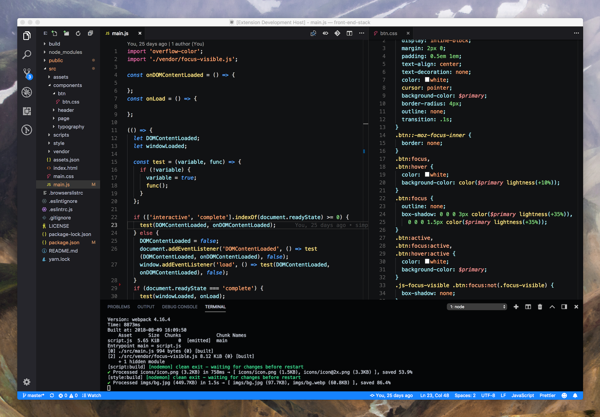
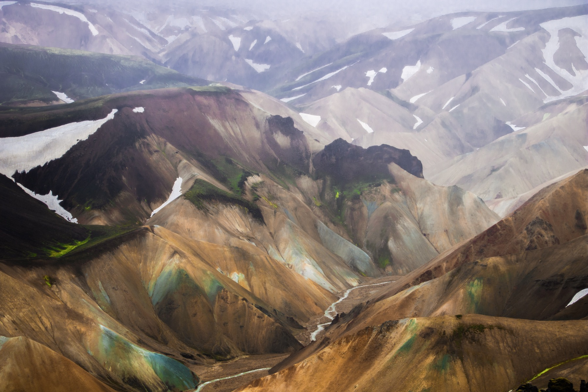

# Landmannalaugar VS Code Theme 

This theme is significantly inspired by the built-in VS Code theme Dark+.

## Installation

Search for "Landmannalaugar" into VS Code extensions explorer.

Then, enable it by going to Code > Preferences > Color Theme.

### [Github repository](https://github.com/dimitrinicolas/landmannalaugar-theme)

### [VS Code Marketplace](https://marketplace.visualstudio.com/items?itemName=dimitrinicolas.landmannalaugar)

Landmannalaugar, Iceland

## Related

- [landmannalaugar-iterm-colors][landmannalaugar-iterm-colors] - iTerm colors inspired by Icelandic Landmannalaugar mountains

## License

This project is licensed under the [MIT license](LICENSE).

[landmannalaugar-iterm-colors]: https://github.com/dimitrinicolas/landmannalaugar-iterm-colors
